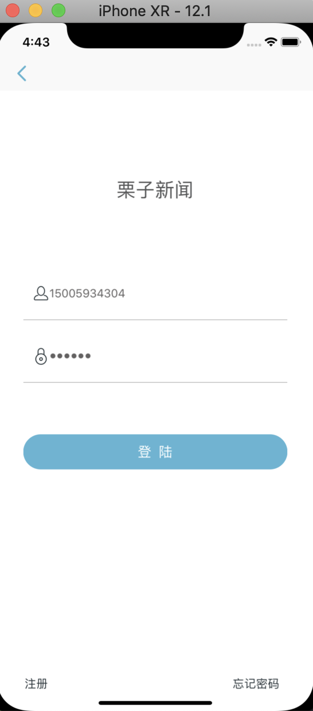
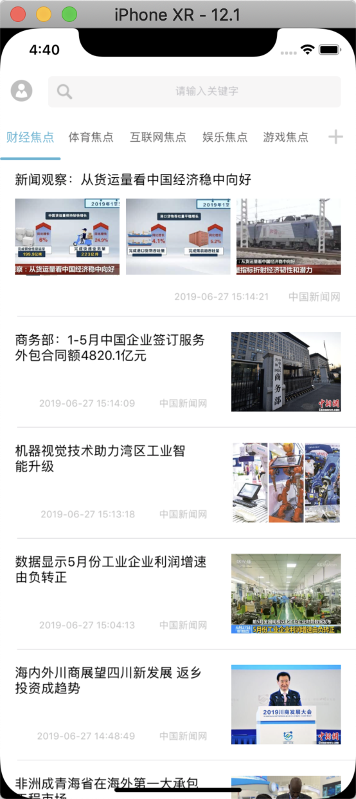
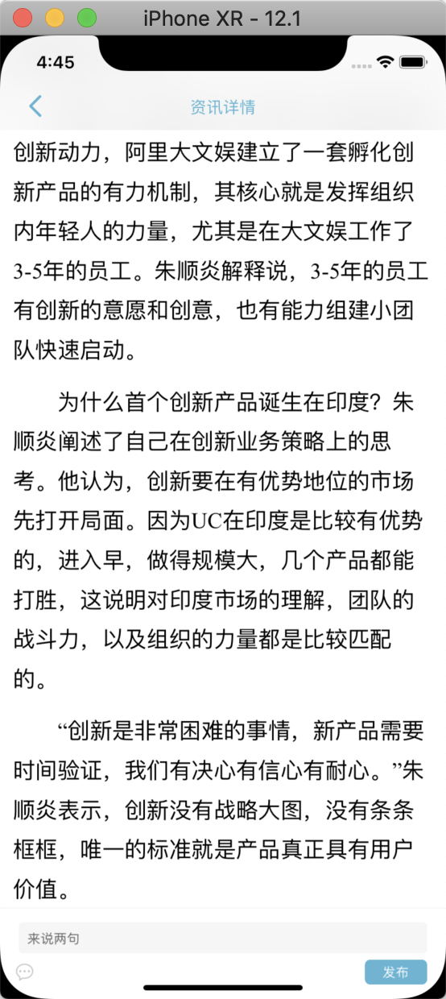
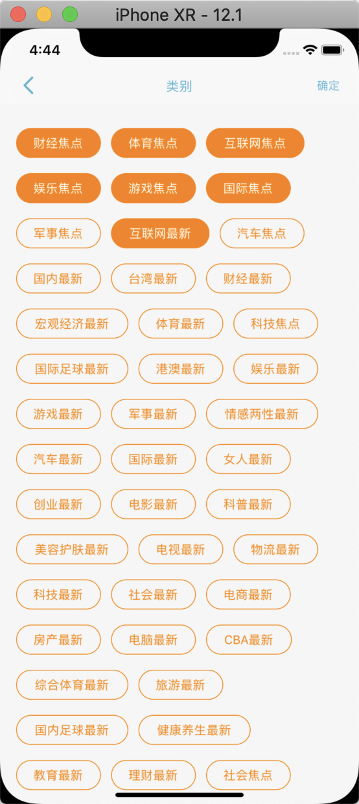
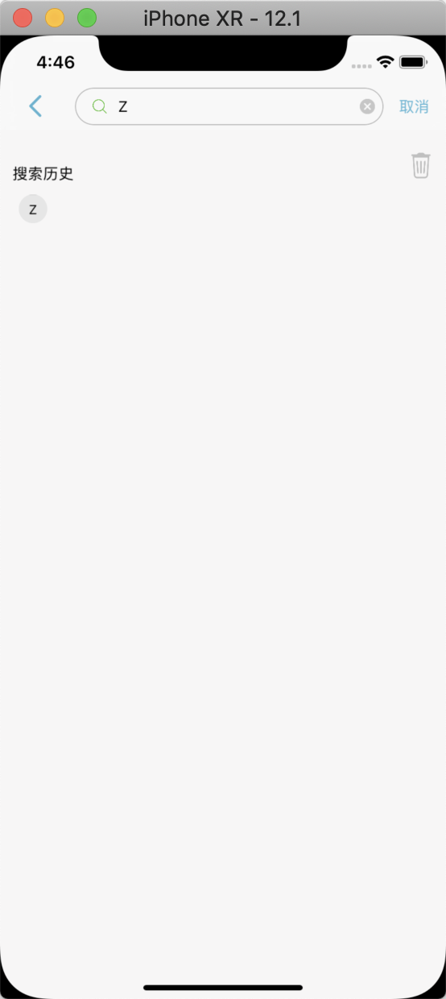
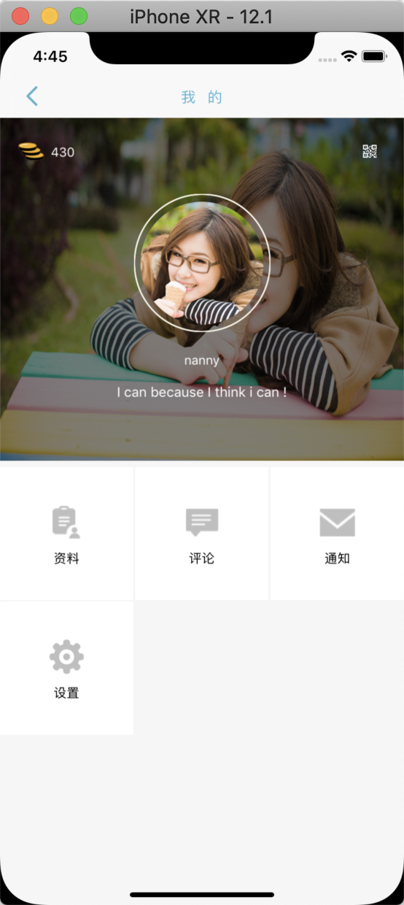

# ZNPlatform
个人代码整理，整理成一个简易的使用平台。
根据自己的需要进行删减库中的东西,一些常用的宏定义和通用功能等。

## 功能：
 1、runtime，使用运行进行时进行统一配置tableview的空白图（全局使用）。   
 2、仿微信朋友圈图片发布ZNCollectionImageView（未使用,查看可直接跳转ViewController控制器进行看效果）。  
 3、检索模块的实现，可直接使用，返回要检索的字符串（首页检索功能使用）。  
 4、图片浏览模块实现，可直接使用（未使用）。  
 5、对AFN网络请求框架的二次封装，方便请求逻辑的统一管理(在appDelegate类（AppDelegate+Net）拓展中统一配置)。  
 6、二维码扫码的实现，以及二维码的生成（暂未使用）。  
 7、分页列表控件的实现。（ZNTabBarContentView，ZNTextTabBarView，在首页使用）  
 8、自定义弹窗AdDialogView，可使用自定义视图进行展示（在第一次安装使用APP的时候展示，在HomeViewController中使用）。  
 9、流式的标签，及其点击事件（点击首页加号可见）。  
 10、常用的类拓展，MD5加密，DES加解密，图片切割，取色，字符串长度，高度的获取，以及view的坐标，高度，宽度获取等等，可以自己看看。  
 
 ##  如果有什么问题，或者需要改进的地方，请联系直接Q我:1553482253,（备注：GitHub），用的开心麻烦给个星，感谢各位看官。
 
### 需要导入的对应的库：（看自己需要）
 pod 'ReactiveObjC'  
 pod 'SDAutoLayout'  
 pod 'SVProgressHUD'  
 pod 'AFNetworking'  
 pod 'SDWebImage'  
 pod 'MJExtension'  
 pod 'Masonry'  
 pod 'MBProgressHUD'  
 pod 'BmobSDK'  

## 示例的效果图  
  
  
  
   
  

